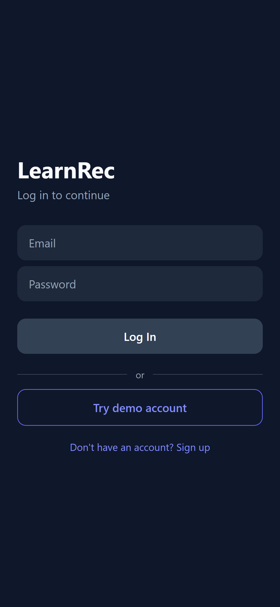
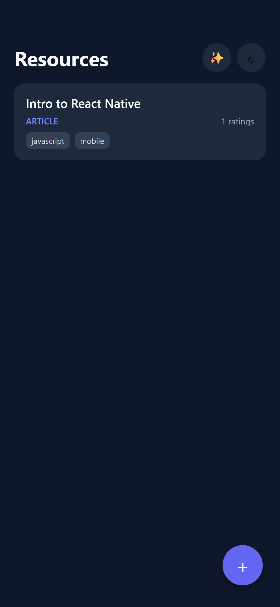
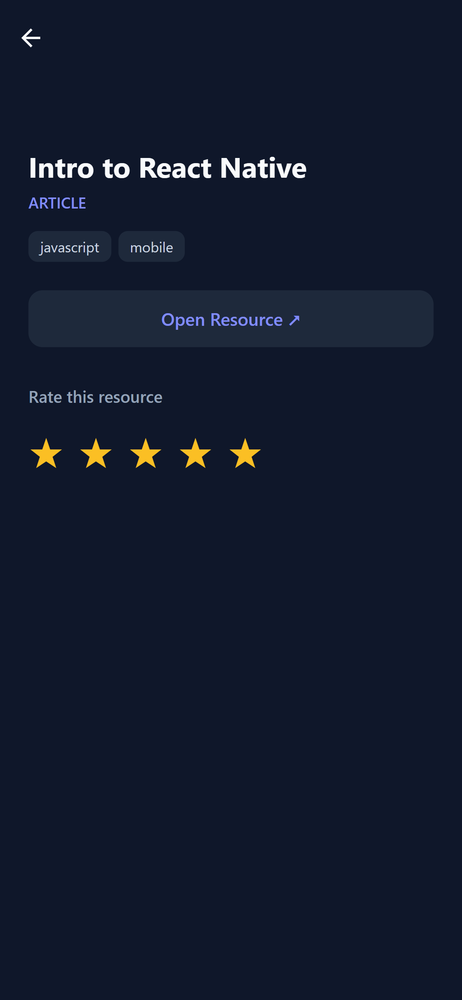
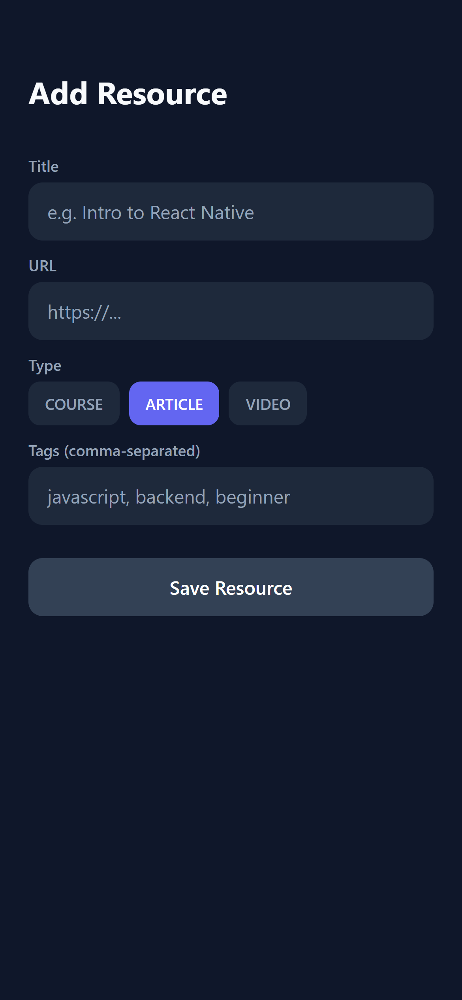

# LearnRec

A learning-resource recommender. Save courses, articles, and videos, rate them, and get tag-based recommendations from what you rated highly.

**Live demo:** [learnrec.vercel.app](learnrec.vercel.app) — click **Try demo account** to skip signup.
**API:** https://learnrec.onrender.com/health

> The API runs on a free tier and sleeps when idle. The first request can take ~30 seconds to wake it.

## Screenshots

| Login | Resources | Detail |
|---|---|---|
|  |  |  |

| Recommendations | Add resource |
|---|---|
|  |  |

## Features

- Email/password auth with JWT (Google OAuth wired on the backend)
- Add, browse, and rate resources (1-5)
- Rule-based recommendations from tags shared with your highly rated resources
- One codebase for iOS, Android, and web (React Native + Expo)

## Tech stack

| Layer | Tech |
|---|---|
| Client | React Native (Expo, TypeScript), React Navigation, Axios |
| Web | React Native Web, static export on Vercel |
| API | NestJS, Passport (JWT + Google), class-validator |
| Database | PostgreSQL (Neon), Prisma 7 |
| Testing | Jest, Supertest, React Native Testing Library |
| CI/CD | GitHub Actions, Render (API), Vercel (web) |

## Architecture

```
Expo app (iOS / Android / Web)  ──HTTPS──▶  NestJS API (Render)  ──▶  PostgreSQL (Neon)
        Vercel (web build)                   JWT auth, Prisma
```

## API

| Method | Route | Auth | Purpose |
|---|---|---|---|
| POST | `/auth/signup` | No | Create account |
| POST | `/auth/login` | No | Log in |
| POST | `/auth/google/token` | No | Log in with a Google ID token |
| GET | `/resources` | Yes | List resources |
| POST | `/resources` | Yes | Add a resource |
| GET | `/resources/:id` | Yes | Resource detail |
| POST | `/resources/:id/rate` | Yes | Rate a resource |
| GET | `/recommendations` | Yes | Get recommendations |
| GET | `/health` | No | Health check |

## Run locally

Each package has its own setup guide:

- [Backend](backend/README.md)
- [Mobile / web](mobile/README.md)

Quick start (PowerShell):

```powershell
# API
cd backend
Copy-Item .env.example .env   # fill in values
npm install
npx prisma migrate deploy
npm run start:dev

# App (new terminal)
cd mobile
npm install
npx expo start --web
```

## Testing

```powershell
cd backend; npm test; npm run test:e2e
cd ../mobile; npm test
```

CI runs on every push and pull request that touches `backend/` or `mobile/`.

## Design decisions

- **Token storage:** SecureStore on native, `localStorage` on web. For production I would use an httpOnly cookie on web to reduce XSS exposure.
- **Migrations at build time:** Prisma migrations run in the Render build step, so the running server never carries the migration CLI's memory cost.
- **Fail-closed CORS:** production refuses to boot without `CORS_ORIGIN`.
- **Recommendations:** transparent tag-overlap rules instead of a black-box model, easy to test and explain.

## Author

Alexis Luzon — [GitHub](https://github.com/alexiseluzon)

## License and disclaimer

Portfolio and demonstration project. Provided "as is", without warranty of any kind. Use at your own risk. The author is not liable for any damages arising from its use.

© 2026 Alexis Luzon. All rights reserved.